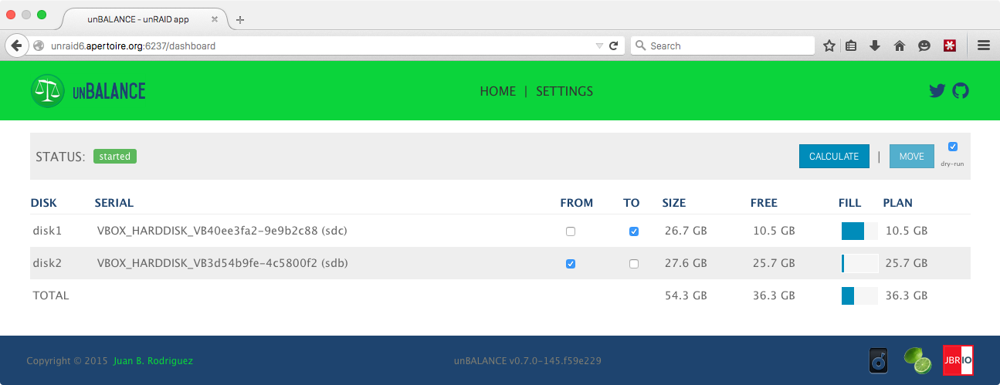

unBALANCE
=========

*tl;dr* **unBALANCE** is an [unRAID](http://lime-technology.com) app to free up space from one of the disks in the array, by moving folders and files to other disks.

## Screenshot


## Introduction
With unBALANCE, you select a disk that you want to have as much free space available as possible, and it will distribute the folders/files to other disks filling them up.

The logic is quite simple:
Get all elegible folders from the source disk
Order the target disks by free space available
For each disk, fill it up as much as possible with folders/files from the source disk, leaving some headroom (currently set at 450Mb).

Internally, all move operations are handled by [diskmv](https://github.com/trinapicot/unraid-diskmv).

The array must be started for the app to work.

You need to select which folders are elegible for moving.

Let's say you have the following unRAID shares:

movies<br>
|_ bluray<br>
|_ dvd<br>
tvshows<br>
games<br>
pictures<br>
backup

You decide, that you want to make space by moving around only bluray movies, games and pictures.

So you will enter 

movies/bluray<br>
games<br>
pictures

in the Settings page, that opens the first time you run the app.

## Install
There are 2 ways to install this application

- Docker app (preferred)<br>
Add the following repository in the Docker GUI<br>
https://github.com/jbrodriguez/docker-containers/tree/templates<br>
Add the container [jbrodriguez]/unbalance
The defaults are <br>
Port: 6237<br>
Volumes: <br>
"/mnt" (required)<br>
"/root" (required)<br>
"/path/to/config/dir" (required)<br>
"/path/to/log/dir" (not required)<br>
"/etc/localtime" (not required, to synchronize time with unRAID)<br>

- Manual
```Shell
# mkdir -p /boot/custom
# cd /boot/custom
# wget https://github.com/jbrodriguez/unbalance/releases/download/<enter latest version here>/unbalance-<enter latest version here>-linux-amd64.tar.gz -O - | tar -zxf - -C .
```
*NOTE*: If run manually, move operations will be performed as root user. Please take that into account.

## Running the app
Start the container or 

```Shell
# cd /boot/custom/unbalance
# ./unbalance
```
As mentioned previously, the app will show the Settings page the first time it's run. Choose the elegible folders now.

By default, the dry-run option is selected.

It means that operations are simulated, it only shows what it would actually do.

To perform the operations, uncheck the dry-run checkbox.

## Credits
This app uses the [diskmv](https://github.com/trinapicot/unraid-diskmv) script (check the [forum thread](http://lime-technology.com/forum/index.php?topic=36201.0) for additional information).

The icon was courteously created by [hernandito](http://lime-technology.com/forum/index.php?topic=39707.msg372508#msg372508) (fellow unRAID member)

It was built with:

- [Go](https://golang.org/) Back End
- [AngularJS](https://angularjs.org/) Front End
- [gin (gin-gonic)](https://github.com/gin-gonic/gin) (REST api)
- [Gorilla WebSocket](https://github.com/gorilla/websocket) (websocket)
- [semver (fsaintjacques)](https://github.com/fsaintjacques/semver-tool) (slightly modified)
- [Gulpjs](http://gulpjs.com/)
- [pubsub](https://github.com/tuxychandru/pubsub/) (slightly modified)


## License
[MIT license](http://jbrodriguez.mit-license.org)
